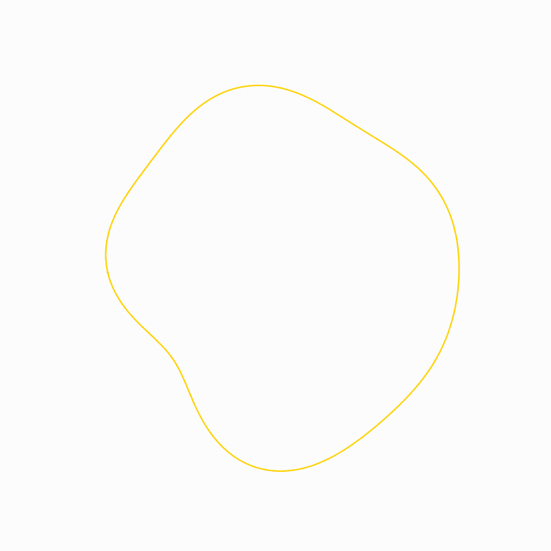

Harmonica
=========

Harmonica is a python package for computing transit light curves of
different shaped occultors. The primary utility of this code is for
mapping exoplanet atmospheres around their terminators, however the
technique can be applied to any transit light curve to derive the shape
of the transiting body. Be sure to have a quick read through of how the
shapes, referred to as :doc:`transmission strings <views/transmission_strings>`,
are defined before you get going.

.. toctree::
   :maxdepth: 2
   :caption: Contents

   Installation <views/installation>
   Transmission strings <views/transmission_strings>
   Quick start <views/quick_start>
   Tutorials <views/tutorials>
   API <views/api/api>
   Citation <views/citation>

Acknowledgements
----------------

Built by David Grant and `contributors <https://github.com/DavoGrant/harmonica/graphs/contributors>`_.

If you make use of Harmonica in your research, see the :doc:`citation
page <views/citation>` for info on how to cite this package. You can find
other software from the Exoplanet Timeseries Characterisation (ExoTiC)
ecosystem over on `GitHub <https://github.com/Exo-TiC>`_.
