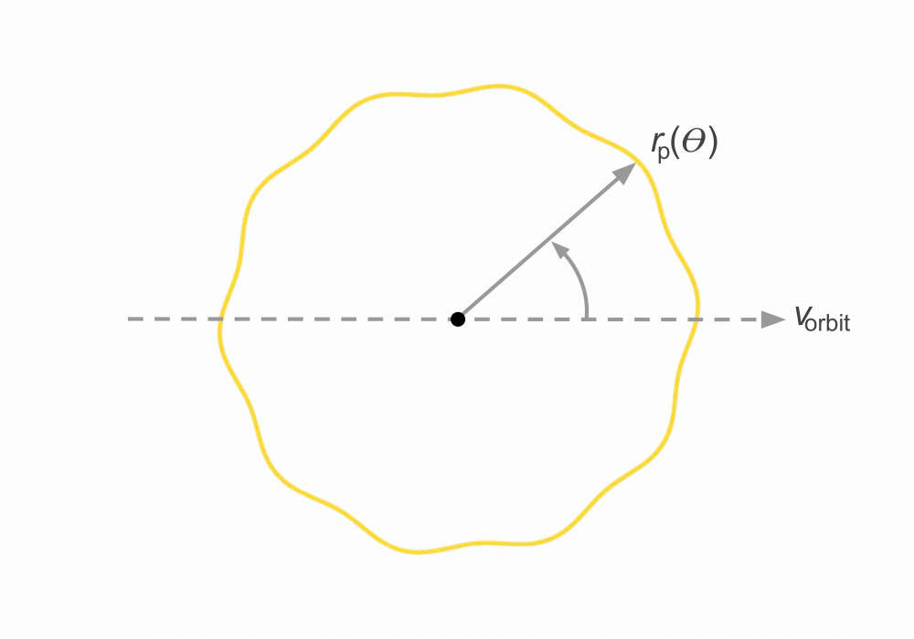
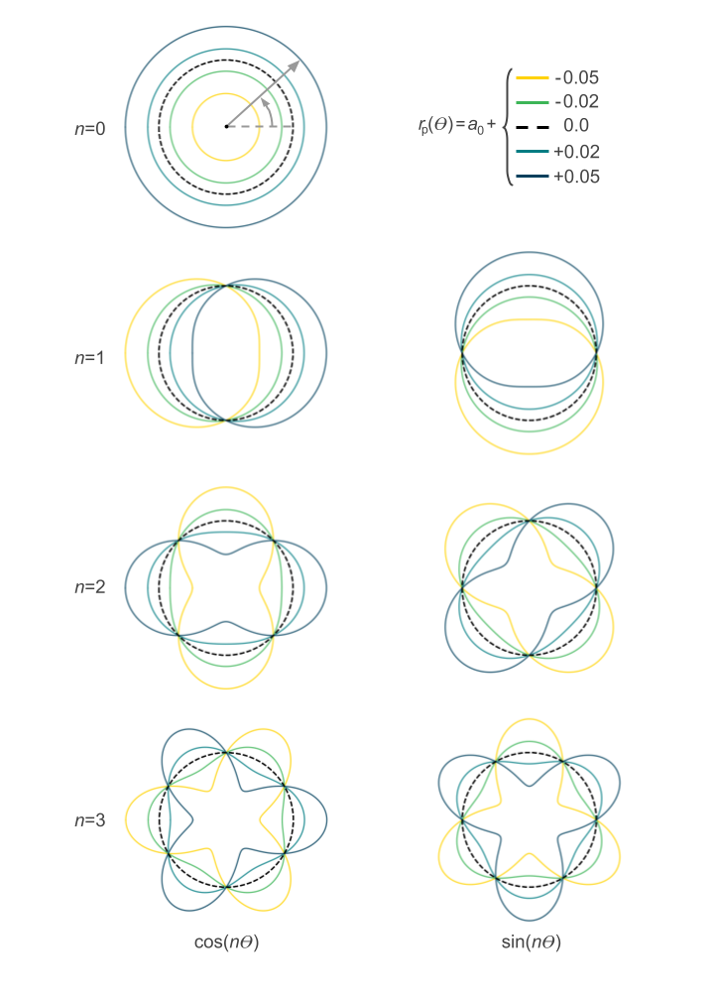

Transmission strings
====================

Harmonica generates light curves for transiting objects, such as
exoplanets, where the sky-projected shape of these objects may
deviate from circles. A given shape is defined by a single-valued
function of angle around the objects terminator, called a transmission
string. In the diagram below we illustrate a transmission string,
:math:`r_{\rm{p}}(\theta)`, where :math:`r_{\rm{p}}` is the
effective radius of the object and :math:`\theta` is the angle around
the terminator from the object's orbital velocity vector.

In Harmonica, a transmission string is parametrised in terms of
a Fourier series. Mathematically we can write

.. math::

   r_{\rm{p}}(\theta) = \sum_{n=0}^{N_c} a_{n} \cos{(n \theta)}
   + \sum_{n=1}^{N_c} b_{n} \sin{(n \theta)},

where :math:`a_n` and :math:`b_n` are each :math:`n\rm{th}` harmonic's
amplitude. The total number of terms is equal to :math:`2N_c + 1`.
Below we show the shape contributions from the first 7 terms.

The above shapes demonstrate the basis (shown up to :math:`n=3`) for
generating various shapes. A transmission string may then be constructed
from a linear combination of each shape contribution. To construct
shapes of increasing complexity, more and more harmonics must be
included. For further reference see
`Grant and Wakeford 2023 <https://doi.org/10.1093/mnras/stac3632>`_.
